# Project 1 Planning: The Unofficial Guide

> Write this document before you write any pipeline code.
> Your spec and architecture diagram are what you'll use to direct AI tools (Claude, Copilot, etc.) to generate your implementation — the more specific they are, the more useful the generated code will be.
> Update the Retrieval Approach and Chunking Strategy sections if you change your approach during implementation.
> Update this file before starting any stretch features.

---

## Domain

<!-- What domain did you choose? Why is this knowledge valuable and hard to find through official channels? -->
Skateboard best practices. This is a domain where there are many opinions and a lot of information is shared through word of mouth, forums, and videos rather than official documentation. A retrieval-augmented generation system could help synthesize this information and provide personalized advice to skateboarders of all levels.
---

## Documents

<!-- List your specific sources: URLs, subreddit names, forum threads, or file descriptions.
     Aim for at least 10 sources that together cover different subtopics or perspectives within your domain. -->

| # | Source | Description | URL or location |
|---|--------|-------------|-----------------|
| 1 |SkateboardGeek.com | A guide to skateboarding tricks |https://skateboardgeek.com/skateboarding-tricks/|
| 2 |Skateboard GB — Learn to Skate Guide | Community-driven beginner guide ("run by skateboarders, for skateboarders") |https://skateboardgb.org/beginners/learn-to-skate-guide/|
| 3 |Skateboard Session — Grip Tape Maintenance & Cleaning | How to clean & replace grip tape (maintenance) |https://skateboardsession.com/maintenance-repairs/skateboard-grip-tape-maintenance/|
| 4 |Surfertoday — Beginner's Guide to Skateboarding | Fundamentals: stance, pushing, turning, stopping |https://www.surfertoday.com/skateboarding/the-beginners-guide-to-skateboarding|
| 5 |Surfertoday — The Story of Thrasher | Skate magazine history & culture feature |https://www.surfertoday.com/skateboarding/thrasher-the-story-of-the-ultimate-skateboard-magazine|
| 6 |Skateboard Session — Skatepark Etiquette | Unwritten rules & etiquette for skating at a park |https://skateboardsession.com/culture-and-community/skate-park-etiquette/|
| 7 |Skate Avenue — Skateboard Size Guide | Deck width & length sizing for beginners (width/length charts) |https://skate-avenue.com/blogs/articles/skateboard-size-guide|
| 8 |Tactics — Skateboarding Safety & Gear Guide | Protective gear and how to fall safely |https://www.tactics.com/info/skateboarding-safety-gear-guide|
| 9 |Tactics — How to Kickflip | Step-by-step trick tutorial (kickflip) |https://www.tactics.com/info/how-to-kickflip|
| 10 |Retrospec — How to Skateboard: 5 Steps for Beginners | Practical beginner tips, disciplines & common mistakes |https://retrospec.com/blogs/gear-guides/how-to-skateboard-5-steps-for-beginners|

---

## Chunking Strategy

<!-- How will you split documents into chunks?
     State your chunk size (in tokens or characters), overlap size, and explain why those
     numbers fit the structure of your documents.
     A review-heavy corpus warrants different chunking than a long FAQ. -->

**Chunk size:** 500 characters

**Overlap:** 75 characters

**Reasoning:** My documents are long-form instructional how-to guides (e.g., step-by-step trick tutorials, buying guides, and safety guides ranging from ~2,500 to 3,000 words), not short reviews or single comments. In this kind of text a single idea — one trick step, one safety rule — usually spans two to three sentences, which i understand to be roughly 300-500 characters. A 500-character chunk is large enough to hold a complete step or instruction rather than a fragment, but still small enough to keep retrieval matches tight and specific to one topic. I chose 75 characters of overlap (about one sentence) because the biggest risk with the chunking size i chose is a key instruction being split across a chunk boundary — the overlap means a sentence that straddles two chunks still appears whole in at least one of them, so retrieval won't return half an instruction. I deliberately avoided very small chunks (e.g., 200 chars), which would fragment single instructions and flood the top-k results with near-duplicate pieces of the same paragraph. To keep chunks readable, the chunker snaps the chunk end and the overlap start to whitespace so words are never split mid-token (a 500-char window that would land inside a word backs up to the previous space).

---

## Retrieval Approach

<!-- Which embedding model are you using (e.g., all-MiniLM-L6-v2 via sentence-transformers)?
     How many chunks will you retrieve per query (top-k)?
     If you were deploying this for real users and cost wasn't a constraint, what tradeoffs
     would you weigh in choosing a different embedding model — context length, multilingual
     support, accuracy on domain-specific text, latency? -->

**Embedding model:** all-MiniLM-L6-v2 - turns text into meaning vectors so you can search by meaning 

**Top-k:** k = 6 closest chunks to be retrieved for each query

**Production tradeoff reflection:** If I were deploying this for real users and cost wasn't a constraint, I might consider using a more powerful embedding model like OpenAI's text-embedding-3-small or a domain-specific model fine-tuned on skateboarding text, if available. The tradeoff would be between the improved accuracy and relevance of retrieval results (especially for nuanced skateboarding terminology and instructions) versus the increased latency and cost of generating embeddings with a larger model. Given that my domain is fairly niche and may contain specific terminology, a more accurate embedding model could significantly enhance the user experience by returning more relevant chunks, even if it means slightly slower response times.

---

## Evaluation Plan

<!-- List your 5 test questions with their expected correct answers.
     Questions should be specific enough that you can judge whether the system's response
     is right or wrong. "What are good dining halls?" is too vague.
     "What do students say about wait times at [dining hall name] during lunch?" is testable. -->

| # | Question | Expected answer |
|---|----------|-----------------|
| 1 | What basic skills should a beginner master before trying tricks? | Stance (regular vs. goofy), pushing, turning, and stopping by foot braking — the fundamentals to learn before attempting the ollie or any trick. |
| 2 | What trick should a beginner learn first, and why? | The ollie — it is the foundational trick that most other tricks (like the kickflip) are built on top of. |
| 3 | What deck width and length should a beginner look for, and why? | An 8.0"-8.25" wide deck is the key beginner choice (more surface area = stability and control); deck length is largely standardized at roughly 31"-32" within an industry range of about 28"-33", so width is the real decision rather than length. |
| 4 | Where are the best skateparks near me to learn at? | (Out-of-scope / grounding test) The system should NOT name specific parks — my documents cover skatepark etiquette but contain no location or quality data, so a correctly grounded system should say it doesn't have that information. |
| 5 | What safety gear should a beginner wear, and why? | A helmet is essential (especially while learning), plus knee pads, elbow pads, wrist guards, and proper shoes. Protective gear reduces the risk and severity of injuries and gives beginners the confidence to progress. |

---

## Anticipated Challenges

<!-- What could go wrong? Name at least two specific risks with reasoning.
     Consider: noisy or inconsistent documents, missing source attribution, off-topic
     retrieval, chunks that split key information across boundaries. -->

1. Noisy or inconsistent documents: Since my sources are a mix of official guides, community forums, and magazine articles, there may be conflicting advice or varying levels of detail across them. This could lead to retrieval returning chunks with contradictory information (e.g., one source recommending a certain deck width for beginners while another suggests a different size).

2. Chunks that split key information across boundaries: Even with my planned chunk size and overlap, there's a risk that important instructions or tips could be split between two chunks, leading to retrieval returning incomplete information. For example, a crucial safety tip might be cut off at the end of one chunk and not fully included in the next, which could result in the system providing partial advice that lacks context.

---

## Architecture

<!-- Draw a diagram of your pipeline showing the five stages:
     Document Ingestion → Chunking → Embedding + Vector Store → Retrieval → Generation
     Label each stage with the tool or library you're using.
     You can use ASCII art, a Mermaid diagram, or embed a sketch as an image.
     You'll use this diagram as context when prompting AI tools to implement each stage. -->

```mermaid
flowchart TD
    subgraph BUILD["BUILD TIME - index the corpus once"]
        A["1. Document Ingestion<br/>10 web sources scraped via requests<br/>(browser User-Agent header)<br/>HTML stripped to article text w/ BeautifulSoup<br/>saved as .txt in documents/"]
        B["2. Chunking<br/>custom chunk_text&#40;&#41;<br/>500 chars / 75 overlap"]
        C["3a. Embedding<br/>sentence-transformers<br/>all-MiniLM-L6-v2 (local)"]
        D[("3b. Vector Store<br/>ChromaDB<br/>~300-500 chunk vectors")]
        A --> B --> C --> D
    end

    subgraph QUERY["QUERY TIME - per user question"]
        Q["User question"]
        E["Embed query<br/>same all-MiniLM-L6-v2 model"]
        R["4. Retrieval<br/>ChromaDB similarity search<br/>top-k = 6"]
        G["5. Generation<br/>Groq API LLM<br/>grounding system prompt +<br/>retrieved chunks as context"]
        ANS["Grounded answer<br/>+ source attribution<br/>(refuses if not in context)"]
        Q --> E --> R --> G --> ANS
    end

    D -. vectors searched .-> R
```

**Linear summary (fallback):**
`documents/ (scrape + clean) -> chunk_text() 500/75 -> all-MiniLM-L6-v2 -> ChromaDB | query -> embed -> top-k=6 search -> Groq LLM + grounding prompt -> grounded answer`

---

## AI Tool Plan

<!-- For each part of the pipeline below, describe:
     - Which AI tool you plan to use (Claude, Copilot, ChatGPT, etc.)
     - What you'll give it as input (which sections of this planning.md, which requirements)
     - What you expect it to produce
     - How you'll verify the output matches your spec

     "I'll use AI to help me code" is not a plan.
     "I'll give Claude my Chunking Strategy section and ask it to implement chunk_text()
     with my specified chunk size and overlap" is a plan. -->

_Tool note: **Claude** is my development assistant (code completion / generating and refining the pipeline code). The **Groq API** is not a coding assistant here — it is the runtime LLM component inside the Generation stage that answers the user's questions. So Claude builds the code; Groq runs inside the finished system._

**Milestone 3 — Ingestion and chunking:**
- **AI tool:** Claude (code assistant).
- **Input I'll give it:** my Documents table (the 10 source URLs) and my Chunking Strategy section (500 chars / 75 overlap).
- **Expected output:** an ingestion script that scrapes each URL with `requests` using a browser `User-Agent` header, strips HTML to article text with BeautifulSoup, saves each as a `.txt` in `documents/`; plus a `chunk_text()` function that splits text into 500-character chunks with 75 characters of overlap.
- **How I'll verify:** print the first few chunks and confirm they are ~500 chars, overlap by ~75, and don't cut mid-word/garbled; spot-check that a scraped `.txt` is clean article text (no nav menus or cookie banners) and not a 403 page.

**Milestone 4 — Embedding and retrieval:**
- **AI tool:** Claude (code assistant).
- **Input I'll give it:** my Retrieval Approach section (all-MiniLM-L6-v2, top-k = 6) and my Architecture diagram (build-time vs. query-time split).
- **Expected output:** code that embeds every chunk with `sentence-transformers` (`all-MiniLM-L6-v2`), stores the vectors in ChromaDB, and a query function that embeds a question with the same model and returns the top-6 most similar chunks.
- **How I'll verify:** run my 5 evaluation questions and confirm the retrieved chunks are on-topic (e.g., the deck-size question returns the sizing chunks); check the collection holds the expected ~300-500 chunks.

**Milestone 5 — Generation and interface:**
- **AI tool:** Claude (code assistant) to write the code; **Groq API** is the runtime LLM the code calls to generate answers.
- **Input I'll give it:** my Grounded Generation goals — the LLM must answer only from the retrieved chunks, cite its source, and refuse when the answer isn't in the context (my out-of-scope test, Q4).
- **Expected output:** code that builds a prompt from the top-6 retrieved chunks, sends it to the Groq API with a grounding system prompt, and returns the answer with source attribution; plus a simple query interface (CLI or Gradio/Streamlit).
- **How I'll verify:** run all 5 evaluation questions — confirm answers 1-3 and 5 match my expected answers from the documents, and that Q4 (skateparks) is correctly refused rather than hallucinated.
